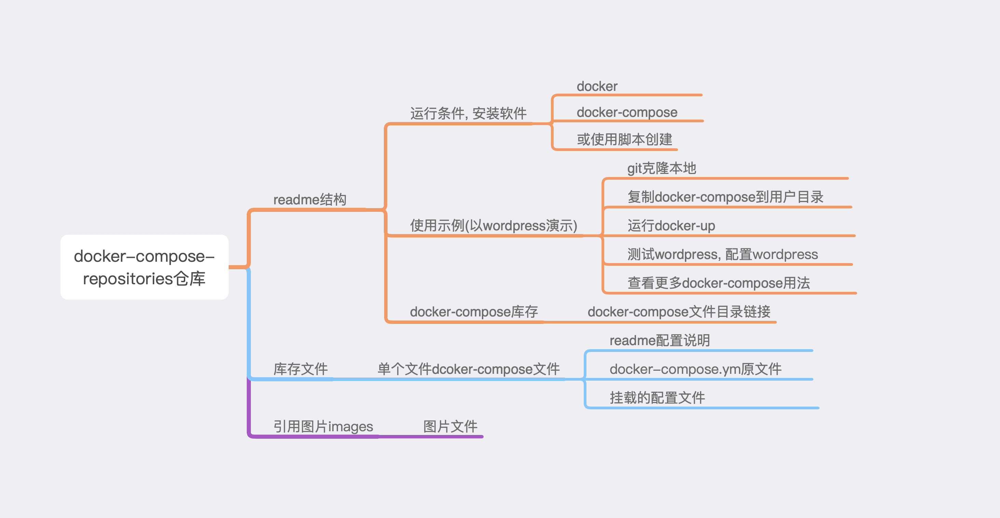

## 存放docker-compose文件仓库, 随意取用


## 目录

### <a href="#first">1. 运行条件</a>
### <a href="#two">2. 使用示例</a>
### <a href="#three">3. docker-compose库存</a>

### 目录结构图解




### <a id="first">1. 运行条件:</a>

#### 需要docker和docker-compose. 如没安装, 可使用[脚本安装]()


### <a id="two">2. 使用示例, 这里以wordpress-nginx-mariadb为例</a>

1. 使用git克隆docker-compose库, 并存放在当前用户目录中(即cd ~/ 所在地方)

```

git clone https://github.com/Charles-one/docker-compose-repositories.git ~/docker-compose

```

2. 复制一份执行文件到用户目录中

```

cp -r ~/docker-compose/wordpress-nginx-mariadb ~/wordpress-nginx-mariadb

```

3. 进行文件夹中, 使用docker-compose 构建镜

```

# 进行需要运行的docker-compose库中
cd ~/wordpress-nginx-mariadb

# up 表示构建, -d后台运行
# 运行后需要下载镜像, 时间比较长.
docker-compose up -d

```

4. 查看wordpress服务

访问地址:

>http://你的服务器ip

设置用户密码即可使用

5. 更多docker-compose用法[请参考这里]().


### <a id="three" >3. docker-compose库存</a>

<a href="wordpress-nginx-mariadb/">wordpress-nginx-mariadb个人博客</a>

<a href="nextcloud">nextcloud个人私有云</a>


